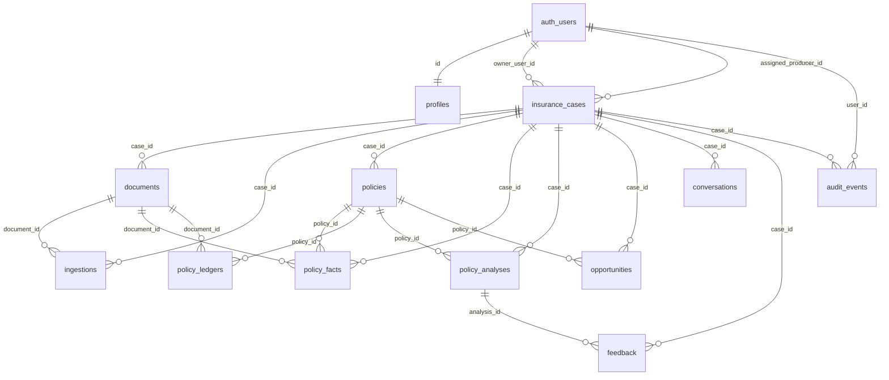

# PolicyWell database architecture

Supabase Postgres is the canonical, version-controlled backend for PolicyWell case intelligence.

## Source of truth

| Layer | Role |
|-------|------|
| `supabase/schemas/*.sql` | **Desired schema state** (declarative). Edit here first. |
| `supabase/migrations/*.sql` | **Versioned apply history** for local + remote. Prefer `supabase db diff -f <name>` when Docker is available. The schema-first delta (`20260810064051_schema_first_delta.sql`) was hand-authored and applied because this environment has no Docker daemon for shadow DB diffs. |
| `src/lib/supabase/database.types.ts` | **Generated TypeScript types** from the live/schema Postgres catalog. Repository code must use these types. |

Do not create domain tables from application code. Do not treat Studio/SQL editor edits as durable — they are invisible to `db diff`.

Commercial V1 tables remain on the imperative migration `20260808233000_commercial_v1.sql` and are outside this PolicyWell case-intelligence schema pack for now.

## Domain model (ERD)



Hierarchy:

```
auth.users
→ profiles
→ insurance_cases
   → documents
      → ingestions
      → policy_facts
   → policies
      → policy_ledgers
      → policy_analyses
   → opportunities
   → conversations
   → feedback
   → audit_events
```

All domain rows ultimately connect to `insurance_cases.id` (ledgers via `policies.case_id`).

## Table purposes (do not collapse)

| Table | Meaning |
|-------|---------|
| `profiles` | App profile 1:1 with `auth.users`. Auth owns credentials — never store passwords here. |
| `insurance_cases` | Root aggregate for a life / annuity / commercial intelligence case. |
| `documents` | Raw source **metadata** + private Storage pointers. Not extracted facts. |
| `ingestions` | Processing **lifecycle** for a document (`queued` → `processing` → `completed` \| `failed`). |
| `policy_facts` | Provenanced **evidence** extracted from documents (field path, value, page, excerpt, confidence). |
| `policies` | Canonical **best-known policy state** derived from verified facts — not a raw extraction dump. |
| `policy_ledgers` | Structured illustration / in-force **time series** by policy year. |
| `policy_analyses` | Derived **intelligence** outputs (JSON). |
| `opportunities` | Actionable **producer** output grounded in `supporting_fact_ids`. |
| `conversations` | Case-scoped Q&A transcripts. |
| `feedback` | Human feedback on recommendations/analyses. Must not silently rewrite scoring engines. |
| `audit_events` | Append-oriented compliance trail. |

## Relationships and delete behavior

- Case delete cascades to case-scoped children (`documents`, `ingestions`, `policies`, `policy_facts`, `policy_analyses`, `opportunities`, `conversations`, `feedback`).
- Document delete cascades to `ingestions` and `policy_facts` / ledger rows that reference the document.
- Policy delete cascades to ledgers/analyses/opportunities; facts `policy_id` set null.
- `audit_events.case_id` sets null on case delete (retain audit row).
- Profile / owner links follow `auth.users` cascade where appropriate; producer assignment uses `on delete set null`.

## Source-of-truth rules

1. **Postgres schema in git** is authoritative for structure (schemas + migrations).
2. **`policies`** is the canonical best-known *state* for UI/producers.
3. **`policy_facts`** is the canonical *evidence* trail; state updates should be explainable from facts.
4. **`documents` + Storage** own the raw bytes/metadata; never public object URLs.
5. **`ingestions`** own job status only — not facts, not analyses.

## Document precedence

When fields conflict across documents, prefer higher rank via `document_precedence_rank(document_type)`:

| Rank | Document type | Meaning |
|-----:|---------------|---------|
| 100 | `annual_statement` | Current carrier statement |
| 80 | `inforce_illustration` | Current in-force illustration |
| 60 | `policy_contract` | Policy contract |
| 40 | `original_illustration` | Original illustration |
| 20 | `application` | Application |
| 0 | other / unknown | Lowest |

**Never delete historical facts** when a newer document arrives. Call `supersede_policy_facts(case_id, field_path, except_fact_id)` (or repository equivalent) to mark prior rows `verification_status = 'superseded'`.

## Ingestion lifecycle

```
document.status: uploaded → processing → ready | failed | archived
ingestion.status: queued → processing → completed | failed
```

1. Upload bytes to private bucket `policy-documents` at  
   `{owner_user_id}/{case_id}/{document_id}/{safe_filename}`.
2. Insert `documents` row (`status = uploaded`).
3. Insert `ingestions` row (`status = queued`).
4. Worker advances ingestion → writes `policy_facts` / ledgers → completes.
5. Future service interface: `ProcessInsuranceDocument` (`src/lib/server/services/process-insurance-document.ts`). **No AI implementation yet.**

## Fact verification lifecycle

| Status | Meaning |
|--------|---------|
| `document_extracted` | Machine-extracted; not yet human-confirmed |
| `user_verified` | Case owner confirmed |
| `producer_verified` | Assigned producer confirmed |
| `superseded` | Replaced by a higher-precedence or newer fact; **row retained** |

## Indexes

Declared in `supabase/schemas/14_indexes.sql`. Primary access patterns:

- Case lists by owner / assigned producer / status
- Children by `case_id` (and `document_id` / `policy_id` where needed)
- Facts by `(case_id, field_path)` and `verification_status`
- Audit / feedback / conversations by user and case

## RLS and client/server security boundary

RLS is enabled on all user-accessible `public` domain tables. Policies are **not** allow-all.

| Principal | Access |
|-----------|--------|
| Case owner (`owner_user_id`) | Full case graph (delete of documents/ingestions/case restricted to owner) |
| Assigned producer (`assigned_producer_id`) | Read/write case graph except owner-only deletes |
| Agency admin | Hook `is_agency_admin_for_case()` — returns false until org membership exists |
| `policywell_admin` profile role | **Not** granted via client RLS OR. Use `service_role` server client only |

**Client (browser / publishable key):** subject to RLS; may use signed URLs for Storage under the user session.

**Server (`service_role`):** bypasses RLS for admin/ops; must never ship to the browser (`src/lib/supabase/admin.ts`).

Repository interfaces live under `src/lib/server/repositories/` and are intended for server-side implementations only.

## Schema file map

| File | Contents |
|------|----------|
| `00_extensions.sql` | `pgcrypto`, shared enums |
| `01_profiles.sql` … `12_audit.sql` | Domain tables |
| `11_feedback.sql` | Feedback |
| `13_functions.sql` | Triggers, RLS helpers, precedence / supersede |
| `14_indexes.sql` | Indexes |
| `15_rls.sql` | RLS policies + grants |
| `16_storage.sql` | Private `policy-documents` bucket + path helpers |

## Local reproduction

With Docker available:

```bash
supabase start
supabase db reset
supabase db diff   # should be empty vs schemas when migrations catch up
npm run typecheck
```

Regenerate types after schema changes:

```bash
supabase gen types typescript --local > src/lib/supabase/database.types.ts
# or Supabase MCP generate_typescript_types against the linked project
```
